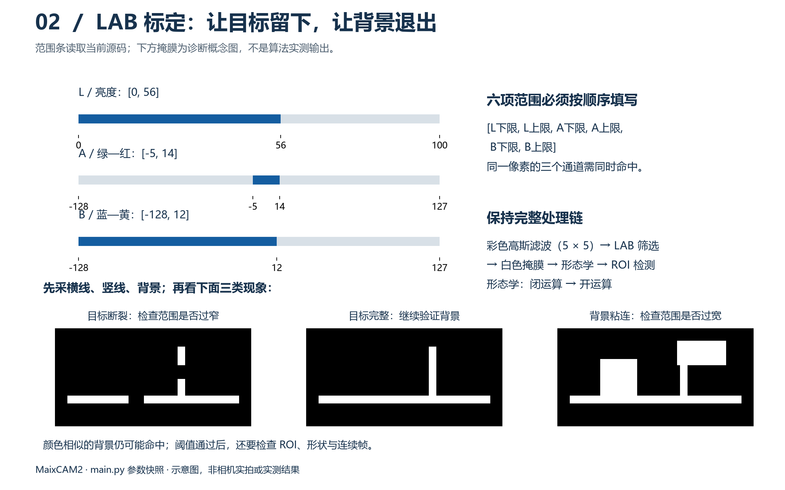
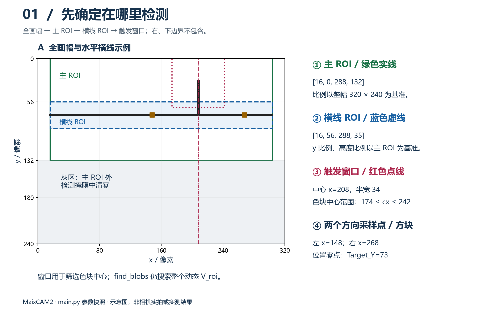
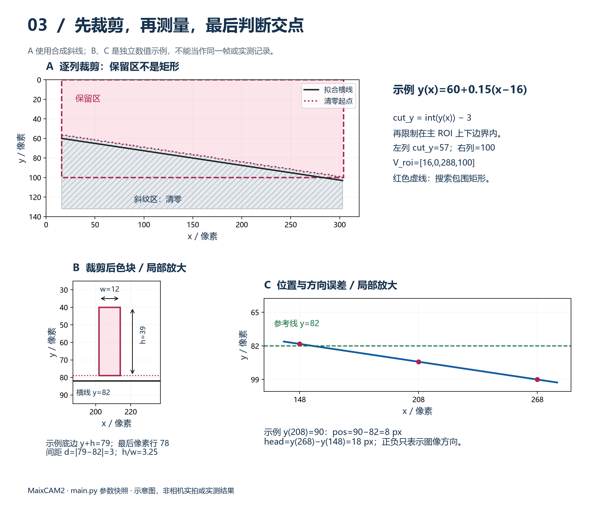
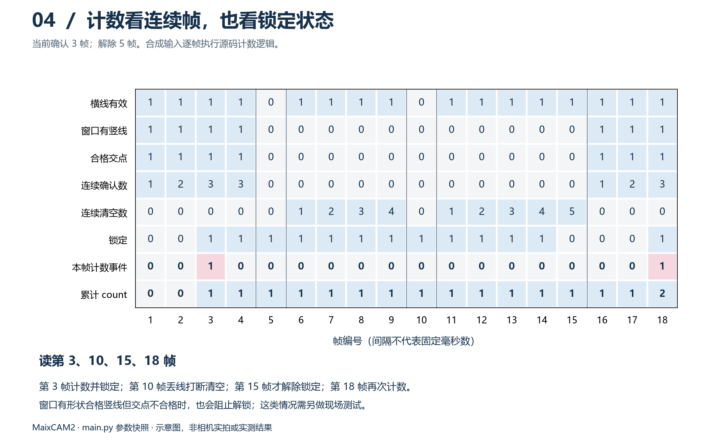

# MaixCAM2 参数实测与 ROI 标定方案

本文对应 [code/main.py](../code/main.py)，面向学过基础Python、第一次做视觉调试的大二同学。参数表、四张示意图、12步操作、调试代码、记录与验收均集中在本文；接线、启动和串口协议见 [main.py README](main_README.md)。 **阅读路线：** 先看参数表和实验准备，再按第1～12步操作。每步写明看什么、改哪里、怎样判断；插入日志是诊断手段，不必一开始全部添加。示意图随相应步骤给出，点击可查看SVG。 当前值是工程初值，不能当成测定结论。[参考照片](../pictures/20260924181420.jpeg) 带彩色标注且显示丢线；离线估计横线中心约73.3，不等于源码零点73.0，更不能证明实机识别通过。 像素px是图像小格子，不是毫米；ROI是搜索区域；掩膜是处理后的黑白图；候选是尚待筛选的目标；连续帧指相邻处理都满足条件，中间失败就重新累计。框面积w×h与有效白像素数不同，不能互相代填。

## 当前参数总表

先保持初值运行；只有对应步骤检查失败，才调整相关参数。“待测”表示缺验证证据，不表示没有默认值。

| 源码参数 |当前值 | 作用、测什么 |
| --- | --- | --- |
| `W` / `H` | 320 / 240 | 分辨率；初调不改，改变后所有像素参数都需复核 |
| `LAB_THRESHOLDS` | `[[0,56,-5,14,-128,12]]` | 保留胶带颜色；测正常光、阴影、反光及背景 |
| `BLUR_KERNEL_SIZE` | 5 | 高斯滤波核；测细线是否被模糊掉 |
| `MORPH_KERNEL_SIZE` | 3 | 先闭后开；测补缺口是否有效、是否抹掉细竖线 |
| `M_ROI_X_RATIO` / `M_ROI_Y_RATIO` | 0.05 / 0.00 | 主区域左上角比例；测目标与干扰的位置 |
| `M_ROI_W_RATIO` / `M_ROI_H_RATIO` | 0.90 / 0.55 | 主区域宽高比例；测偏移、转弯时是否出框 |
| `H_ROI_Y_RATIO` / `H_ROI_H_RATIO` | 0.425 / 0.27 | 横线检测带；比例相对于主 ROI 高度 |
| `L_min_area` / `L_min_pixels` | 100 / 80 | 横线回归前置门限；测弱目标与噪声 |
| `L_min_length` / `MAX_H_slope` | 60 / 0.45 | 最小水平跨度、最大绝对斜率；测遮挡与转弯 |
| `Target_Y` | 73.0 | 位置误差零点；测真正期望车姿下的横线高度 |
| `HEADING_SAMPLE_HALF_WIDTH` | 60 | 左右方向采样距中心的距离；测外推与方向稳定性 |
| `MIN_V_ROI_HEIGHT` | 24 | 竖线搜索框最小高度；不恢复已清掉的像素 |
| `V_TO_LINE_GAP` | 10 | 从横线上方多少像素开始清零；测残留横线与竖线长度 |
| `MARK_MIN_AREA` / `MARK_MIN_PIXELS` | 50 / 35 | 色块前置筛选；测最弱地标是否有候选 |
| `MARK_MIN_HEIGHT` / `MARK_MAX_WIDTH` | 14 / 28 | 裁剪后色块尺寸；测最短、最宽合法地标 |
| `MARK_MIN_ASPECT_RATIO` | 1.8 | 高/宽的最小值；测倾斜地标与短宽干扰 |
| `MAX_JUNCTION_GAP` | 12 | 色块底边与拟合横线的最大纵向间距；测真交点与悬空干扰 |
| `Mark_trigger_x_ratio` | 0.65 | 触发中心横坐标比例；测首次计数位置 |
| `MARK_TRIGGER_HALF_WIDTH` | 34 | 允许中心偏离的距离；测驻留时间与相邻地标清空 |
| `JUNCTION_CONFIRM_FRAMES` / `JUNCTION_RELEASE_FRAMES` | 3 / 5 | 连续确认/跟踪出窗后解锁；测误触发、漏计、重复计数 |
| `MARK_MAX_STEP` / `MARK_RELEASE_MARGIN` | 16 / 4 | 相邻帧跟踪位移上限/出窗余量；测最高车速和边界抖动 |
| `BINARY_WHITE_THRESHOLDS` | `[[200,255]]` | 固定选掩膜白色，通常不调 |
| `Mark_half_w` | 34 | 未使用，不参与标定 |

## 实验准备与场景编号

1. **先复制再调。** 复制 `code/main.py`，另存为 `code/main_calibration.py`。本文临时日志与显示切换都加在这个副本。最终仅把验证通过的参数值回填正式文件。
2. **固定一轮条件。** 相机支架、分辨率、胶带、地面、灯光先不动；先静止、再手推、最后电机低速运行。
3. **一次只改一个参数。** 先记旧值，改一个数字，保存，停止旧程序，重新运行，再摆回同一位置比较。需要联动的参数会特别说明。
4. **只改指定位置。** 参数在文件顶部；循环内代码前有4个空格，`for` 内有8个。保留空格，不混用Tab。看到 `IndentationError` 就先恢复缩进。
5. **会变好也要看副作用。** 目标出现了，但背景也出现大量白块，不算调好。修改无改善或出现新问题，恢复上一组值。

每轮先写一行：`日期_场景_轮次 / 参数旧值→新值 / 改前现象 / 改后现象 / 保留或恢复 / 截图文件`。不要凭记忆同时试十几个数。 **先把桌面准备好：** 左边打开副本代码，右边打开本文，下方留出控制台。新建一个记录文件夹（例如 `outputs/本次标定日期/`），按 `S0_原图_改前`、`S0_掩膜_改后` 命名截图。参数记录表保存配置结论，另用纸张或表格按轮次记录过程。场景S0～S8、N0/N1的摆放方法见下方场景表。全文数字例子都只是教你计算；只有你亲自读到的值才能填进“实测”栏。若同一问题连续两轮修改仍没改善，恢复基线，保存原图、掩膜、参数和报错，重新检查正在运行的文件及处理顺序。

| 场景编号 |怎样摆 | 主要检查什么 |
| --- | --- | --- |
| S0 基准 | 正常光，车放在纸胶带定位处 | 全流程基线、零点 |
| S1/S2 偏移 | 车头方向不变，移到允许的两侧极限；记实际距离 | 主框、横线框是否截线 |
| S3/S4 转向 | 回到基准，转到允许的两侧角度；记角度或车身标线 | 斜率、裁剪、方向采样 |
| S5/S6 远近 | 最远和最近的合法地标位置 | 最小白像素、最短高度、最大宽度 |
| S7/S8 光照 | 固定车姿，使用现场阴影和反光位置；记灯光条件 | 阈值是否断线、背景是否粘连 |
| N0/N1 干扰 | 仅横线无地标；再测试接缝、黑点、悬空竖条 | 是否错误增加count |

## 第1步：先保存基线并让画面正常出现

**本步改什么：** 不改视觉参数，只运行标定副本。

1. 让电机保持停止，把车摆在真实胶带边上，使画面同时看到横线和一个上方竖线。
2. 用 MaixVision 连接设备，打开刚保存的 `main_calibration.py`，停止之前运行的程序，再点“运行当前文件”。不要点“运行项目”误跑正式main.py，也不要同时运行两个占用相机的文件。
3. 看控制台有没有错误，再看图像是否连续更新。若提示 UART 或引脚映射错误，按 README 查接线、设备版本和端口；此时先不调 LAB。
4. 保存一张基线截图，记下当前参数和支架位置。以后每次比较都尽量回到这里。
5. 画面可能显示 `line:lost`，这不妨碍开始排查；但此时不能拿pos占位值去标零。

**本步结束条件：** 有稳定图像、无运行报错。连接操作参考 [MaixVision 官方文档](https://wiki.sipeed.com/maixpy/doc/zh/basic/maixvision.html)。

## 第2步：学会切换三种画面

在副本中用搜索功能找到文件末尾的 `disp.show(img)`。它在主循环里面，前面有4个空格。**替换这一行，不是另加一行。** 每次停止、保存、重跑后再观察。

| 想看什么 | 这一行应写成 | 看到什么 |
| --- | --- | --- |
| 原图、彩框、pos/head/count | `disp.show(img)` | 默认画面；检查拟合线是否贴着真实胶带 |
| 胶带有没有被正确选出来 | `disp.show(binary_img)` | 黑白图；胶带应为白色，背景大部分为黑色 |
| 横线是否已经被切掉 | `disp.show(V_binary_img)` | 黑白图；横线及其下方应被清掉，留下上方竖线 |

例如要看掩膜，完整替换行是：

```python
    disp.show(binary_img)
```

没有彩框是正常的：框画在 `img` 上，黑白图没有画框。主 ROI 外变黑也正常，不是镜头坏了。动态情况下，分次切换得到的截图不是同一帧；要做细节对照，先固定车不动。 检查是否运行了正确副本：把显示切为黑白图后，设备画面也应变为黑白；仍是彩色说明可能没有重跑或选错文件。MaixVision的预览“暂停”只暂停图像传输，不能当成停止设备程序，修改前要停止运行。 **本步结束条件：** 你能区分三种画面，并能恢复 `disp.show(img)`。

## 第3步：先检查 LAB，不要急着改几何参数



[查看图2矢量版](images/maixcam2_lab_calibration.svg)。白色是保留的胶带，黑色是去除的背景；下方三种掩膜是概念示例，不是本机实测。处理顺序为彩色高斯滤波→LAB筛选→灰度掩膜→闭运算→开运算。 **看什么：** `binary_img`。**改哪里：** 顶部 `LAB_THRESHOLDS`，初值为 `[[0,56,-5,14,-128,12]]`。

1. 看正常灯光下的横线和竖线：应基本连续变白。再看没有胶带的地面：不应有大片白色连到目标。
2. 固定车，换一个阴影位置、一个有反光的位置重复检查。若都正常，保持 LAB 不变，直接进入第4步。
3. 若失败，先切回原图：胶带本身已因失焦、强反光或拖影而看不清时，先改善成像，不能只靠加大阈值。
4. 原图清楚时，先停止副本，打开设备已有的“找色块”应用。按官方界面，点胶带内部，左侧会显示颜色块及LAB读数；先抄数，再点该颜色块可生成候选阈值。记录设置栏六项范围，退出应用后手动填入副本，不会自动同步到Python文件。若当前固件没有该应用，可用MaixVision预览框选小区域并选LAB直方图；界面操作按安装版本核对。不要在红框、文字或胶带边缘取样。
5. 正常光、阴影、反光各记录3～5处横线、竖线、背景的LAB值。下表可抄到纸上；这是起步数量，不是充分验证。

| 场景 | 对象：横线/竖线/背景 | L | A | B | 是否靠近边缘 |
| --- | --- | --- | --- | --- | --- |
| 正常光/阴影/反光 | 待填 | 待填 | 待填 | 待填 | 待填 |

六个数按 `[L下限,L上限,A下限,A上限,B下限,B上限]` 填。L范围0～100，A/B范围-128～127；每个下限必须不大于上限。不同软件若显示RGB或OpenCV 8位LAB，不能直接照填。设备取样步骤参考 [官方 LAB 调参说明](https://wiki.sipeed.com/maixpy/doc/zh/vision/find_blobs.html)。

6. 找出“哪个通道挡住了胶带”。演算例：胶带样本L=58，其余通道在当前范围内，而L上限是56；可以只将56试改为58，再回到副本查看掩膜。**58只是这个假设样本的例子，不是要求你直接照改。**
7. 若背景也变白，查看背景样本哪个通道能与胶带区分，试着收紧那个边界，每次1～2单位。目标与背景三个通道都重叠时，先改成像或检测区域，不持续放宽。
8. 每改一次，就重新检查横线、最细竖线和背景。工具采的是原图，程序还会滤波和形态学处理，最终以程序掩膜为准。

**抄写检查：** 例如只改L上限，改的是列表第2个数，外面的两层方括号和其余5个数保持原样。如果同一个胶带样本L、A都越界，只改L后仍可能不白；重新对照三个通道，不能直接认定L调整无效。 **本步结束条件：** 三类光照下横、竖线可见，背景不明显粘连；保存成功和失败截图。不要修改 `BINARY_WHITE_THRESHOLDS`，它只负责选已经生成的白色像素。

## 第4步：只有细线被抹掉时，才试滤波核

**看什么：** `binary_img`。**先保持：** LAB、ROI和全部几何门限。

1. 摆出最远、最细的合法竖线，记录当前 `BLUR_KERNEL_SIZE=5` 的掩膜。
2. 若原图清楚但掩膜明显变细或断裂，只把高斯核5试改为3，重跑并比较。若目标恢复且噪声可接受，记为候选；若没改善，恢复5。
3. 高斯核只用正奇数，如3、5、7；不要填写0、2、4。为了让程序“更稳”盲目增大核，反而可能把细线抹掉。
4. 若怀疑闭/开运算改变了目标形状，只把 `MORPH_KERNEL_SIZE=3` 临时试为1作对照。若1保住细线、3丢失细线，说明形态学需要复核；1也可能留下更多噪声。
5. 每次只改其中一个核，回到正常光、阴影、反光再比较。保留能兼顾细线和背景的最小必要处理强度。

**本步结束条件：** 最细目标没有明显被处理抹掉。若修改了核，回到第3步复查LAB效果，再往下走。

## 第5步：让检测框覆盖目标，不覆盖太多干扰



[查看图1矢量版](images/maixcam2_roi_calibration.svg)。坐标原点在左上，x向右、y向下。主ROI绿色、横线ROI蓝色；红色窄框是触发窗口，并不是检测出的地标。

```text
主ROI：[int(320×0.05), int(240×0), int(320×0.90), int(240×0.55)]
       = [16,0,288,132]，包含x=16～303、y=0～131
横线ROI：[16, 0+int(132×0.425), 288, int(132×0.27)]
         = [16,56,288,35]，包含y=56～90
触发中心：int(320×0.65)=208；允许色块中心174≤cx≤242
方向采样：左x=148，右x=268；pos=y(208)-73.0，head=y(268)-y(148)
```

ROI格式为 `[x,y,宽,高]`，右/下边界不包含。主ROI比例以整图为基准，横线ROI比例以主ROI高度为基准。触发窗口只筛色块中心，实际仍在整个V_roi搜索，窗外粘连也会影响形状。 **看什么：** `img` 原图叠加。当前主框 `[16,0,288,132]`，横线框 `[16,56,288,35]`。

1. 先摆回参考姿态，看真实横线是否在蓝色横线ROI内；不用要求它与绿色目标高度线完全重合。
2. 保持车头方向，分别手动平移到允许的两侧极限；然后回到中间，小幅向两侧转向。每个姿态停住截图，记录横线上边缘和下边缘的y坐标。
3. 看的是胶带整条粗带，不只是中线。转向后左右端高度可能不同，两个端都要检查。
4. 只要本轮所有合法姿态都在框内，先保持ROI不变。如果横线超出框，再按下面方法重算；不要先降低面积门限，因为门限找不回框外的线。

**横线框怎么算：** 选上边界 `y_top`、下边界 `y_bottom`（不包含），适当留出重复摆车的波动余量；再算 `H_ROI_Y_RATIO=(y_top-main_top)/132`、`H_ROI_H_RATIO=(y_bottom-y_top)/132`。 演算例：若你测得合法胶带都在y=44～100，选择检测带40～104（104不包含），可试 `0.304` 和 `0.485`。代码计算 `int(132×0.304)=40`、`int(132×0.485)=64`。这是教你换算，不是当前推荐值；扩框后必须复查是否把更多竖线或干扰也纳入拟合。

5. 修改比例后重跑，用截图核对实际边界；小数会被 `int()` 舍去，不要只看计算器近似值。
6. 主ROI只有在目标出主框、或车体/线缆干扰进入主框时再改。x与宽除以320，y与高除以240；主框变了，横线框比例的基准也变，必须一起重算。
7. 屏幕缩放时不要直接把鼠标坐标当320×240坐标。优先保存原尺寸图再读数；知道有效显示宽高时，先扣除黑边再按比例换算。

**读坐标练习：** 保存图像后先查尺寸是否320×240，在能显示像素坐标的看图工具中指向胶带上/下边缘读y。若有效预览恰为640×480，鼠标相对图像左上角的y=128，对应原图y=64；窗口边框和黑边不计入。没有坐标工具时，在副本 `disp.show(img)` 上方临时插入下段，利用每10像素一条线估读（精度不足时改用原尺寸坐标工具）：

```python
    for cal_y in range(0, H, 10):
        img.draw_line(0, cal_y, W - 1, cal_y, image.COLOR_GREEN, 1)
        img.draw_string(0, cal_y, str(cal_y), image.COLOR_GREEN)
```

记录表每行写 `场景/y最小边缘/y最大边缘/是否越界`。这里是整条粗带在该姿态中的最上、最下位置；若最低像素为100，包含它的下边界至少为101。坐标网格只用于原图几何读数，读完删除，不能用带网格画面采LAB。 **本步结束条件：** 合法姿态下目标都在相应框内，主框不越界，横线框在主框内，拟合没有明显被新增前景拉偏。

## 第6步：确认拟合线是真的横线

**看什么：** 原图上的蓝色拟合线与 `line:lost`。有一条蓝线不等于拟合正确，必须贴着真实胶带。

1. 如果胶带在掩膜中连续、在横线ROI内，却总是丢线，可以临时输出回归候选。
2. 在副本搜索 `for a in lines:`，将下面代码放在其下一行、原 `temp_dx` 之前。每行前保留8个空格；只做静态短测，测完删除。

```python
        cal_dx = a.x2() - a.x1()
        cal_dy = a.y2() - a.y1()
        print("CAL_H", a.x1(), a.y1(), a.x2(), a.y2(),
              abs(cal_dx), cal_dy / cal_dx if cal_dx else None)
```

一行依次为 `CAL_H,x1,y1,x2,y2,水平跨度,斜率`。演算输出 `CAL_H 16 74 303 74 287 0.0` 表示跨度287、斜率0，能通过当前60和0.45的筛选。没有输出可能是候选列表为空；不是测得面积为0。

3. 有正确候选但跨度不到60：先看是否被遮挡/截框。确认确为合法短线后，才把60小幅降低，如每次5，并立即测试接缝、黑点是否误选。
4. 正确候选斜率超过0.45：先确认这种转向属于允许范围；确需覆盖时，才每次增加0.05试验。不要为了接受错误竖线而放宽。
5. 完全没有候选：先复查掩膜和ROI。仍无候选时，在同一静态场景分别试降 `L_min_area`（每次10）、`L_min_pixels`（每次10），另一项保持不变，不降到0。若不能定位，恢复旧值并保存失败图。
6. 若拟合到了错误前景，先查LAB、粘连和ROI，不能仅用“有线了”作为成功标准。

**本步结束条件：** 在第5步各姿态下能重复得到正确拟合，错线和丢线都有记录，是否达到最终要求按预设限值判断。删除 `CAL_H` 临时日志。注意：日志里的端点跨度是回归输出的跨度，不能据此推算原始白像素数。

## 第7步：把位置误差的零点定下来

**只改：** `Target_Y`。当前73.0是源码保留的初值，不能通过随便摆车、让数字变0来定义正确车距。

1. 与负责控制的同学先确定实际希望保持的车距和车头方向，在地面用纸胶带标出车轮/车身位置。
2. 把车摆到标记处，确认拟合线正确、没有 `pixel:invalid`。每隔约0.5秒抄一个屏幕pos，共20个有效数；无效时不要填0，另记一次失败。
3. 当前 `pos=y(208)-73.0`，所以每个有效高度可以按 `y=pos+73.0` 算出。屏幕有一位小数，适合初调；更精细时再采程序变量。
4. 将20个y从小到大排序，取第10与第11个的平均作为中位数。若用Excel，填在A2:A21，输入 `=MEDIAN(A2:A21)`；不要把说明文字或无效占位0混入。
5. **演算例：** 中位数为75.1时，才把 `Target_Y` 试改为75.1。保存重跑，车仍摆在同一标记处，观察pos是否在0附近波动。
6. 把车移开再摆回来，重复3次。若三次零点差异很大，先查安装松动、光照、错误拟合或摆车误差，不机械平均。
7. 向两侧做相同距离的小平移，记pos变化方向；向两侧小幅转向，记head变化方向。先记录，不凭图像正号直接决定舵机正负号。

**算一次给你看：** 假设本轮仍为73.0，5个有效pos是1.8、2.1、2.0、1.9、2.2，则高度为74.8、75.1、75.0、74.9、75.2，排序中位数75.0，候选新零点为75.0。正式练习用20个数；如果之前已改过零点，要加“本轮旧值”，不能继续加73.0。 方向采样半宽60先保留。看原图两个绿色小方块是否落在可信拟合范围内；代码允许在端点外延长线上取值。如果短线场景外推明显，先改善ROI和拟合；确需改半宽时，记录新的左右x及间距，并通知控制同学重测增益。理想车姿head长期不为0时先检查安装滚转，不能靠改位置零点修复。 **本步结束条件：** 同一车姿能重复接近同一零点，误差变化方向可解释。head长期不接近0时查相机滚转和拟合对象，改 `Target_Y` 不会改变head。初调保留方向半跨度60。

## 第8步：横线切干净后，再检查竖线



[查看图3矢量版](images/maixcam2_geometry_calibration.svg)。三个面板是独立演算例，不代表同一帧。A中横线为 `y(x)=60+0.15(x-16)`，左右清零起点分别为50、93，V_roi为 `[16,0,288,93]`；红色包围矩形内仍有已清零区域。 动态裁剪逐列计算 `cut_y=int(y(x))-V_TO_LINE_GAP`，限制在主ROI上下边界内，再从cut_y向下清零。V_roi高度取各列保留高度的最大值，至少为MIN_V_ROI_HEIGHT、至多为主ROI高度；增大最小高度不会恢复已删像素。B中色块底边y+h=63，最后像素行为62，d=10；C中pos=81-73=8、head=90-72=18，单位都是px。 **先看：** `V_binary_img`。**先改：** `V_TO_LINE_GAP`，当前10；图解见本步图3。

1. 摆出一个完整地标，先用原图确认横线有效，再切到裁剪图。正常应看到上方竖线，横线粗带和下方区域应变黑。
2. 如果竖线底部仍拖着一条横向白带，只把gap从10试到11，再看一次；仍残留再试12。gap越大，切掉的竖线也越多，不要一次加十几。
3. 如果竖线被切得太短，可每次减1对照，但减小后必须复查横线残留。找到“横线刚能去干净、竖线还能保留”的范围。
4. 每次改gap，都要重新检查竖线高度与交点间距。当前 `MAX_JUNCTION_GAP=12` 不能盲目设得比正常裁剪造成的间距还小。
5. 本帧估计：水平线y≈73.3时，从 `int(73.3)-10=63` 开始清零，最后保留y=62。一个y=3、h=60的框底边为63，与横线整数高度73相差10。

### 看不懂为什么被拒绝时，临时打印候选

搜索 `for b in blobs:`，把下面代码放在其下一行、原 `if b.w() <= 0:` 之前。保留8个空格；只用已有的坐标接口，不添加函数或封装。

```python
        cal_ratio = b.h() / b.w() if b.w() else None
        cal_gap = abs(b.y() + b.h() - int(
            line.y1() + (b.cx() - line.x1()) * line_dy / line_dx
        )) if line_pixel_valid else None
        print("CAL_V", b.x(), b.y(), b.w(), b.h(), b.cx(),
              b.w() * b.h(), b.pixels(), cal_ratio, cal_gap)
```

输出依次是 `CAL_V,x,y,w,h,cx,框面积,白像素数,h/w,d`；`None` 表示无法计算，不是0。`b.pixels()` 与框面积是两列不同数据，接口见 [官方Blob API](https://wiki.sipeed.com/maixpy/api/maix/image.html#pixels)。没有CAL_V时，目标可能已被面积/像素前置门限滤掉；多个色块会各打印一行，要按x/y对照真实目标。 **演算输出：** `CAL_V 199 3 21 60 209 1260 1000 2.857 10`。按顺序检查：高60≥14、宽21≤28、比值2.857≥1.8、中心209在174～242内、间距10≤12，都合格。白像素1000是此处假设值，不是从照片测出的结果。

| 按顺序检查 | 当前应满足 | 不满足先做什么 |
| --- | --- | --- |
| 候选是否存在 | 有CAL_V | 先看裁剪图是否有完整竖线，再查前置面积50、白像素35 |
| 高度h | ≥14 | 查是否裁太多；确为最短合法地标才试降，每次2 px |
| 宽度w | ≤28 | 查横线残留或粘连；确为近处宽地标才试加，每次2 px |
| h/w | ≥1.8 | 查倾斜和裁剪；确为真地标才试降，每次0.1 |
| cx | 174～242 | 窗外不计数是正常的；先把地标手推入窗 |
| 横线 | 有效 | 先修好横线，不能用旧横线判断交点 |
| 间距d | ≤12 | 查裁剪/斜线；覆盖真实d时每次试加1，同时测悬空干扰 |

6. 候选完全没有、但裁剪图有小而完整的竖线时，分别试调面积50或像素35，每次减5、保持正数；无改善就恢复，不同时把两项放到很低。
7. 对每个候选只记录第一个失败条件；先解决它，再往后看。通过后拿接缝、黑点、短宽块和不接横线的竖条做负样本，检查是否误计数。

把多次真地标的 `w/h/白像素/h÷w/d` 分列，分别找最大宽、最小高、最少白像素、最小比例和最大间距；干扰另记一张表。最小门限需放过最弱目标，最大门限需覆盖最大合法值，再留波动余量。`merge=True, margin=2` 可能合并邻近色块；出现异常宽块先查粘连。丢横线时不会执行逐列裁剪，V_roi退到顶部最小高度；此时不能继续标定交点间距。 **本步结束条件：** 最短、最宽、倾斜地标都能通过，干扰不会轻易通过。删除CAL_V，再恢复原图显示。

## 第9步：不用电机，先手推完成一次计数



[查看图4矢量版](images/maixcam2_timing_calibration.svg)。图用合成输入执行源码计数片段：第3帧计数，第10帧丢线打断释放累计，第15帧解锁，第18帧再次计数；帧间隔不代表固定毫秒数。图中解锁须先跟踪到已计数地标出窗；即使后续色块消失，最后观测位置仍用于释放计数。 **初次保持：** 中心0.65、半宽34、确认3帧、解锁5帧。

1. 让横线始终在视野中，把地标放在窗口外，记当前count为N。不要通过挡住横线来模拟“地标离开”。
2. 缓慢手推地标进入窗口；等到 `mark:1`，应看到count变N+1、lock变1。
3. 停住2～3秒，count应保持N+1。随后继续同方向手推地标离开窗口，同时保留有效横线。
4. 等lock回0，再推入下一个地标；应再次只增加1。先做5次慢推，记每次开始/结束count及真实通过数。
5. 如果有框却不计数，先看交点是否连续合格；如果一直lock=1，查 `latched_x` 是否曾跟踪到出窗位置、单帧位移是否超过16像素，以及释放累计期间横线是否丢失。

需要看逐帧状态时，在末尾 `disp.show(img)` 的上一行临时加入以下代码，前面4个空格：

```python
    print("CAL_S", int(line_pixel_valid), int(junction_candidate),
          junction_streak, latched_x, junction_clear_streak,
          int(junction_latched), int(junction_event), junction_count)
```

依次是 `横线有效,合格交点,连续确认数,已计数地标最近横坐标,连续释放数,锁定,本帧事件,累计数`。每行对应一次处理；日志只用于定位短时故障，会影响速度，完成后删除。若启动后count从0开始，第一次地标中心保持x=208且连续3帧合格，可看到下列演算序列：

```text
CAL_S 1 1 1 None 0 0 0 0
CAL_S 1 1 2 None 0 0 0 0
CAL_S 1 1 3 208 0 1 1 1
CAL_S 1 1 3 208 0 1 0 1
```

第三行事件为1、累计加1，第四行事件回0、累计仍为1。地标须被逐帧跟踪至中心超出 `208±(34+4)`；之后横线有效帧的连续释放数应依次1、2、3、4、5，第5帧lock才归0；中途横线无效就从0重来。出窗后色块暂时消失，源码仍沿用最后的出窗位置累计；出窗前消失或一步移动超过16像素，可能长期保持锁定。N0无地标、N1干扰也各手推一轮，count不应增加。 **本步结束条件：** 进入计一次、停留不重复、有效跟踪到出窗能解锁。地标退出后再倒回来可能重新计数，这是当前算法的行为，不是身份跟踪。

## 第10步：测处理速度，再逐级加快车辆速度

只有前9步通过才让控制端加入运动。先由控制同学小幅、低速试验反馈方向：修正动作后pos/head应趋向目标；若误差增大，先停止并检查方向和控制设置，不改视觉零点来掩盖。

### 可选：直接测每轮处理间隔

先删掉CAL_H/CAL_V/CAL_S，恢复 `disp.show(img)`。在副本原有import下面，另加一行（无缩进）：

```python
from maix import time
```

再在 `while not app.need_exit():` **之前**加入（无缩进）：

```python
cal_last_ms = time.ticks_ms()
cal_start_ms = cal_last_ms
cal_frames = 0
cal_max_ms = 0
```

最后在末尾 `disp.show(img)` **之后**加入（每行按下面保留4/8个空格）。这样采样点包括本轮显示，间隔也包含上一轮打印可能产生的开销：

```python
    cal_now_ms = time.ticks_ms()
    cal_max_ms = max(cal_max_ms, cal_now_ms - cal_last_ms)
    cal_last_ms = cal_now_ms
    cal_frames += 1
    if cal_frames == 100:
        cal_elapsed_ms = cal_now_ms - cal_start_ms
        print("CAL_RATE", cal_frames * 1000 / max(1, cal_elapsed_ms), cal_max_ms)
        cal_start_ms = cal_now_ms
        cal_frames = 0
        cal_max_ms = 0
```

例如 `CAL_RATE 25.0 60` 表示该100轮窗口约25次/秒、最长间隔60ms，**这只是演算输出，不是已测性能**。等待第一组启动数据过去，再记后续多组。不是有效横线率、曝光帧率或下位机接收率；打印仍会影响结果。接口参照 [MaixPy时间API](https://wiki.sipeed.com/maixpy/api/maix/time.html#ticks_ms)。

### 怎样根据失败现象调窗口和帧数

1. 在地面标出起终点，用手机录像实际地标通过；分别测低速、计划速度和最高计划速度，每档先做10次。
2. 每次记 `count_end-count_start` 与人工真值，而不是直接拿累计总数当本轮数量。逐个地标核对录像，分别记录漏计、重复计、首次计数位置；一漏一重可能抵消，总数正确仍会失败。暂停或倒车单列。车速可用标出的直线路段长度除以通过时间估计，单位写清，不把图像px/s当成车辆cm/s。
3. 如果慢速正常、高速漏计，短时启用CAL_S，查看最长连续候选是否够3帧。先排查拖影、丢线和卡顿，不立即改3。
4. 确认仅因驻留不足时，可先降车速；若试把半宽34加到38，必须同时测试最近间距两个地标能否留出5帧有效空窗。
5. 第二个地标漏计且lock一直为1时，先查前一地标是否被跟踪到越过窗口加4像素余量、随后是否有5帧有效横线；未跟踪到出窗时，单纯缩小窗口或减少释放帧数未必有效。窗口过宽可试34减到30，再复查第一个地标能否满足3帧。34→38/30都是对照试验，不是最终推荐。
6. 只有连续日志证明需要且负样本复测通过，才考虑确认3改2或解锁5改4。不要同时改两项，也不要改为1图省事；降低帧数可能增加误触发/重复计数。

帧数不是毫秒数。粗略规划：帧率为f、地标图像速度为vx px/s时，宽68的窗口驻留约 `68/|vx|` 秒；确认可按至少 `3/f` 加余量估算。真实采样相位和漏帧会影响结果，最终看连续日志，不用公式代替实测。 **演算例：** 若f=25、vx=200 px/s，驻留约0.34秒，3/f=0.12秒；仍要检查是否连续合格。相邻地标中心图像间距若仅100 px，仅看窗口的间隔约 `(100-68)/200=0.16秒`；本算法还需看到旧地标越过窗口外4像素余量，并在此后累计5帧有效横线。相邻间隔短可能来不及解锁。以上假设匀速、无漏帧、无干扰，不是当前设备性能结论。若从CAL_V日志估vx，另加时间戳并在同一个地标上取两次cx差/时间差；没有关联同一目标的数据就不要计算。接收端另外记录完整报文到达时间：统计平均及最长间隔，并统计valid=1比例。有效报文比例不能发现“拟合到了错线”，要结合录像检查；主循环速率、有效识别率、串口接收率、端到端延迟是不同指标。 **本步结束条件：** 计划速度下候选与出窗跟踪都够用，独立重复通过结果符合团队限值。测完删除3处计时修改及额外time导入；正式配置下再次完整通过测试。

## 第11步：把“计数位置”和“停车位置”分开调

1. 在地面分别标出希望首次计数的位置和最终停车位置，用录像记录两个时刻；窗口中心x=208不是车辆停车线。
2. 当前算法在地标进入窗口并连续确认后就计数，不等地标到中心。先保持车速不变，重复测首次事件出现的地面位置。
3. 首次计数位置稳定但有偏差时，再试调 `Mark_trigger_x_ratio`。先观察车前进时地标在画面里往左还是往右；不要凭感觉决定加减。
4. 可每次改变约4像素作对照，对应比例约 `4/320=0.0125`。看实测事件位置往哪边移动，再决定保留或恢复；不能保证两个行驶方向都用同样修正。
5. 修改中心后，位置误差取样和左右方向采样也改变，必须回到第7步复核零点。
6. 首次事件正常、但车仍停车过远或过近时，由控制端根据通信、执行和制动延迟调整；不要通过改 `Target_Y` 来改变停车距离。

每轮记录 `车速/首次count变化时车辆基准点位置/停稳后该基准点位置/两者距离`。统一以同一车轮轴线或车身标记读尺，不能一次量车头、一次量车尾。用录像同帧拍到车辆与计数显示，可估事件位置；显示有延迟，精确验收需控制端事件时间或同步记录。 **本步结束条件：** 计数事件和最终停车分别有记录；控制同学确认反馈方向、阶段count基准及超时处理。

## 第12步：回填正式参数，做一次独立复测

1. 在参数记录表填实测范围、最终值、证据文件和结论；失败或未测的项目照实保留，不全部改为“已标定”。
2. 只把经过复测的参数值从副本复制回 `code/main.py`，不把CAL日志、计时变量或临时显示一起复制进去。
3. 确认正式文件末尾是 `disp.show(img)`；确认串口仍为 `valid,pos,head,count` 四字段，没有夹入调试文本。
4. 用新位置、新一轮通过过程复测正常光、阴影、反光、最远/最近地标、允许转角、最高速度及相邻地标。旧地标返回、遮挡和丢线也要单测。
5. 重新打包安装、重新上电，确认实际运行的是当前参数，count从0开始且下位机能正确处理重启。
6. 保存最终源码版本、相机安装照片、参数记录表和至少一组失败→修正→复测记录。以后改变安装、光照或处理核，按方案中的联动表重测。


## 记录与验收

在 [参数表](maixcam2_parameter_record.xlsx) 中填写范围、最终值及证据；过程另按下表逐轮记录。未测留空或写“未测”，不要用0代替。

| 轮次/场景 | 参数旧→新 | 改前→改后现象 | 干扰是否通过 | 保留/恢复 | 截图或日志 |
| --- | --- | --- | --- | --- | --- |
| 示例：R01/S5，非实测 | 高斯核5→3 | 细线断裂→连续 | 未测，因此暂不定稿 | 候选，待复测 | 待填 |

| 验收项 | 怎么量 | 团队预先填写的限值 | 实测结果 |
| --- | --- | --- | --- |
| 横线有效比例 | 同一时段valid=1的报文数/完整合法报文总数；另看错线录像 | 待填；错线须单列 | 未测 |
| 零点重复性 | 3次回摆后的pos中位数和波动范围 | 待填，px | 未测 |
| 计数 | 逐个地标对照录像，分别记录漏计、重复计和无目标误计 | 待填，次数/总通过数 | 未测 |
| 更新间隔 | 正式显示/串口负载下的平均与最长接收间隔 | 待填，ms | 未测 |
| 触发/停车偏差 | 分别量首次计数、完全停止位置到各自基准线的距离 | 待填，mm或cm | 未测 |
| 连续运行与重启 | 规定时长内检查退出、卡顿；重新上电核对count基准 | 待填，时长与恢复要求 | 未测 |

总数相等不一定全对：漏一个、重复一个也会抵消，必须逐个核对。验收限值应按题目与控制需求确定；本方案没有实际板卡测试结果。

## 改动后哪些需要重测

| 改动 | 必须跟着检查 |
| --- | --- |
| 光照、曝光、白平衡、胶带或地面 | LAB、掩膜连续性、色块尺寸、计数 |
| 相机安装或分辨率 | 全部ROI、像素门限、零点及动态计数 |
| LAB、滤波核、形态学 | 横线拟合、裁剪后尺寸和间距 |
| 主ROI或横线ROI | 整数坐标、错线、方向采样外推、零点 |
| 触发中心 | Target_Y、左右采样点、首次计数位置 |
| 裁剪间隔 | 竖线高度、白像素数、交点距离 |
| 窗口半宽、确认/解锁帧数、车速 | 驻留、空窗、误计/漏计、实际触发与停车位置 |

## 图表更新与资料归档

四张图是教学示意，不是板端实测。已有Python、Matplotlib、NumPy及微软雅黑字体的电脑，可在项目根目录运行：

```powershell
python docs/images/draw_roi_calibration.py
```

脚本读取main.py参数，输出PNG、SVG、预览和 [生成清单](images/maixcam2_roi_calibration_manifest.json)；预期输出包含 `Exported 4 figures` 和 `layout bounds PASS`。修改参数后重新生成并人工核对正文；这不能代替现场验收。
