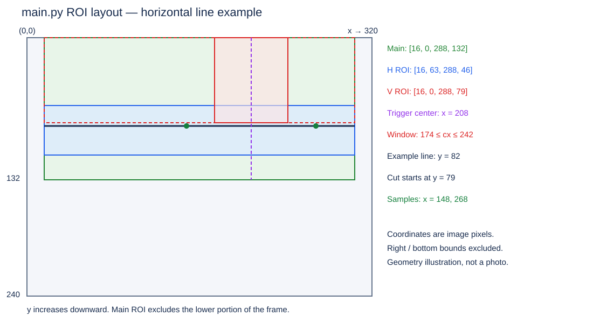
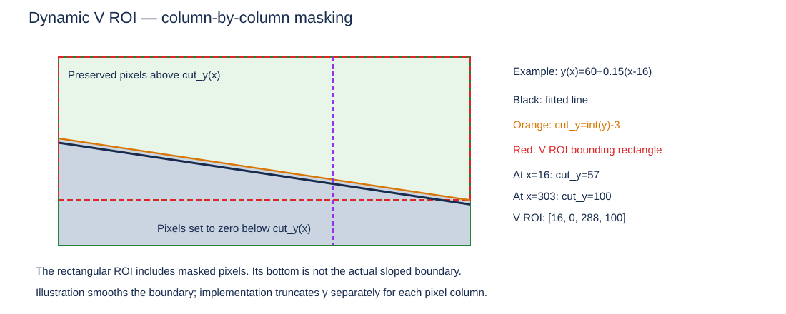

# main.py：MaixCAM2 视觉端运行与联调

对应程序：[code/main.py](../code/main.py)。逻辑参照：[main_dual_roi.py](../code/main_dual_roi.py)。本文按当前 `320 × 240` 参数编写；调整源码参数后需同步更新数值与图示。

程序负责黑胶带横线测量、库边竖线地标识别、交点累计计数和串口输出。电机、舵机 PID、巡线/泊车/出库阶段切换由控制端负责。框架已通过语法与模拟状态路径检查，真实识别率、帧率和硬件接口仍需 MaixCAM2 实测。

## 1. 运行入口与依赖

1. 固定相机安装高度、俯仰角和画面方向，记录 MaixCAM2 型号、固件及 MaixPy 版本。
2. 用 MaixVision 连接设备，打开并运行 **`code/main.py`**。不要同时运行参照脚本；两个程序会使用同一相机和 UART。
3. 板端需具备 `maix`、`cv2`、`math`。电脑能通过语法检查不代表板端依赖齐全。
4. 确认屏幕有图像、ROI 边框及 `pos/head/mark/count/lock`，再检查串口输出。
5. 先静置或手推验证识别与反馈方向，再启用车辆闭环控制。

当前相机调用为 `camera.Camera(W, H)`，未显式设置像素格式、曝光或帧率；随后通过 `image.image2cv(..., ensure_bgr=True, copy=True)` 转为 OpenCV BGR 图。与参照脚本显式指定 `FMT_BGR888` 的写法不同，板端需记录实际表现。

`disp.show(img)` 同时用于设备显示及 MaixVision 图像预览，具体连接和运行操作见 [MaixVision 官方说明](https://en.wiki.sipeed.com/maixpy/doc/en/basic/maixvision.html)。曝光和相机设置需按所用固件核对 [官方相机文档](https://wiki.sipeed.com/maixpy/doc/zh/vision/camera.html)。本文不假定程序已锁定曝光。

## 2. 程序框架和每帧逻辑

```text
初始化参数、相机、显示、UART、跨帧计数状态
  ↓
采集 → BGR → 高斯滤波 → RGB 图按 LAB 阈值筛选 → 单通道二值掩膜 → 闭运算 → 开运算
  ↓
主 ROI 外清零 → 二值图横线回归 → 跨度/斜率筛选 → 选最长候选
  ↓
有横线：计算位置误差、方向误差和角度；无横线：误差无效
  ↓
复制二值图 → 有横线时逐列屏蔽横线及下方 → 构建竖线 ROI
  ↓
查找色块 → 形状筛选 → 触发窗口 → 有效横线/交点间距 → 选最近候选
  ↓
连续确认 → 首次确认计数并锁定 → 连续离开后解除锁定
  ↓
更新 vision_result → 发送 UART → 绘制状态 → 下一帧
```

### 2.1 图像和横线

- `LAB_THRESHOLDS=[[0,56,-5,14,-128,12]]`：横线与竖线特征共用的当前配置，需现场复测；依次为 `[L_MIN,L_MAX,A_MIN,A_MAX,B_MIN,B_MAX]`，L 范围为 0～100，A/B 为 -128～127。
- 高斯滤波保留彩色信息，再转为 RGB 图调用 `binary(LAB_THRESHOLDS)`；命中 LAB 范围的像素为白色，其余为黑色，最后转为单通道掩膜供原有检测流程使用。接口见 [MaixPy 官方 API](https://wiki.sipeed.com/maixpy/api/maix/image.html#binary)。
- 当前启用 3×3 矩形核的闭运算和开运算，依次填补小缺口、清除小噪点；细竖线是否被抹除需现场复核。
- `binary_img.get_regression()` 使用处理后的二值图，`BINARY_WHITE_THRESHOLDS=[[200,255]]` 用于选白色前景。
- 横线候选需满足 `abs(dx) >= 60`、`abs(dy) <= abs(dx) * 0.45`，再按候选长度选择最长者。
- `L_min_length` 实际限制水平跨度，不是直接限制线段长度；跨度检查也避免后续除零。
- `MAX_H_slope=0.45` 对应图像水平夹角约 ±24.2°，不是车辆实际转角。

### 2.2 像素误差

图像原点在左上角，x 向右、y 向下，单位为像素。横线方程为：

```text
y(x) = y1 + (x-x1) × dy/dx
mark_trigger_x = int(W × Mark_trigger_x_ratio) = 208
position_error_px = y(208) - Target_Y
sample_x_left  = max(main_left, 208 - 60) = 148
sample_x_right = min(main_right - 1, 208 + 60) = 268
heading_error_px = y(268) - y(148)
```

`Target_Y=82.0` 时，位置误差为正表示横线在参考位置处低于目标高度；方向误差为正表示右采样点比左采样点更靠下。控制端需要实测确定电机/舵机反馈符号，不能直接把正值解释为“向左转”。

`head` 是高度差，不是角度；`line_angle` 才是归一化到 `(-90,90]` 的角度。它们都不是厘米或车体真实姿态。调整分辨率、采样跨度或相机姿态后，应重新标定控制参数。

### 2.3 地标与计数

色块按以下顺序检查：宽度大于零 → 高度至少 14 → 宽度至多 28 → 高宽比至少 1.8 → 中心距 x=208 不超过 34 → 横线有效 → 色块底部与横线预测交点的 y 差不超过 12。最后选择距离触发中心最近的合格候选。

`mark_in_window` 在交点间距检查前置为真：只要窗口内还有形状合格的竖线，即使未形成合格交点，也会阻止解除锁定。

| 状态 | 作用与更新时机 |
| --- | --- |
| `line_pixel_valid` | 每帧重置；本帧找到合格横线并算出误差后为真 |
| `junction_streak` | 连续候选帧数；无候选或丢线立即清零 |
| `junction_confirmed` | 连续候选达到 `JUNCTION_CONFIRM_FRAMES=3` |
| `junction_event` | 未锁定状态下首次确认的这一帧为真 |
| `junction_count` | 事件发生时加一；仅进程启动时清零 |
| `junction_latched` | 计数后锁定，地标停留期间不重复计数 |
| `junction_clear_streak` | 横线有效且窗口无竖线才累计；其他情况清零 |

`junction_clear_streak` 达到 `JUNCTION_RELEASE_FRAMES=5` 才解除锁定。丢线会打断连续确认和连续离开，但保留累计数及锁定状态。当前帧结果不能沿用上一帧的确认事件。

## 3. ROI 划分与图示

所有 ROI 均为 `[x, y, width, height]`，右/下边界不包含在区域内。例如 `[16,0,288,132]` 包含 x=16～303、y=0～131。



图中绿色为主 ROI，蓝色为横线 ROI，红色为竖线 ROI/触发窗口；示例横线位于 y=82。图示为几何说明，不是实拍识别结果。

| 区域 | 计算方式 | 当前值与用途 |
| --- | --- | --- |
| 全图 | `W × H` | `320 × 240` |
| `main_roi` | `[W×0.05, H×0, W×0.90, H×0.55]`，逐项取整 | `[16,0,288,132]`，排除画面边缘和下方车体 |
| `H_roi` | x/宽继承主 ROI；y 加 `int(132×0.48)`；高 `int(132×0.35)` | `[16,63,288,46]`，y=63～108，用于横线回归 |
| `V_roi` | `[main_left,main_top,main_width,V_roi_height]` | 高度随横线改变，用于竖线色块检测 |
| 触发窗口 | 中心 x=208，半宽 34；纵向沿 `V_roi` | 候选色块中心需满足 `174 ≤ cx ≤ 242` |
| 误差采样点 | 中心左右各 60，并限制在主 ROI 内 | x=148 和 x=268 |

触发窗口只是色块位置筛选和显示标记，不是单独的 `find_blobs()` ROI。代码绘制宽 68 的矩形表示窗口，但数值筛选以 `abs(cx-208) <= 34` 为准，不能仅凭边框像素判断边界。

### 动态竖线 ROI



对主 ROI 的每个横坐标 x：

```text
cut_y(x) = max(main_top, min(int(y(x)) - V_TO_LINE_GAP, main_bottom))
V_binary_cv[cut_y(x):main_bottom, x] = 0
V_roi_height = min(max(24, 各列 cut_y-main_top 的最大值), main_roi[3])
```

`V_TO_LINE_GAP=3` 表示从横线上方 3 像素开始清除，减少横线与竖线粘连。实际有效区域随横线倾斜，`V_roi` 只是包围该区域的矩形，矩形内有一部分已置零。

- 水平线 y=82：裁剪位置为 79，`V_roi=[16,0,288,79]`。
- 图二示例 `y(x)=60+0.15(x-16)`：左端裁剪位置为 57，最右有效列 x=303 的裁剪位置为 100，`V_roi=[16,0,288,100]`。
- 丢线时：不执行逐列清除，使用最小高度 24；由于横线无效，竖线不能通过交点判断，不产生新计数。

## 4. 用 MaixCAM2 实测并标定参数

详细操作、四张分步图、参数调整顺序与复测清单见 [MaixCAM2 参数实测与 ROI 标定方案](MaixCAM2参数实测与ROI标定方案.md)。

### 4.1 建立可重复的测量环境

固定相机与车体，使用正式场地和胶带。记录安装高度、俯仰角、光照、分辨率和曝光模式。先让相机画面稳定，再采样；如果调整曝光，按官方相机文档及当前固件确认方法，并记录设置。

当前程序没有自动标定、参数滑块或日志保存功能。以下调试输出应放在单独的标定副本中；正式文件及通信协议保持可追溯。修改参数一次只动一组，重复相同路线比较。

### 4.2 查看中间图像

当前循环末尾使用 `disp.show(binary_img)`，检查胶带是否变成连续白色、背景是否基本为黑色。在标定副本中，查看原图叠加结果时替换为 `disp.show(img)`，查看竖线裁剪时替换为 `disp.show(V_binary_img)`。这些变量均已由程序创建，不需要新增图像转换 API。

测量像素坐标可使用原始尺寸图像；若预览经过缩放，必须按比例还原到 320×240。优先读取程序变量，避免把屏幕显示尺寸当成图像坐标。

### 4.3 参数测量顺序

| 参数组 | 板端测量方法 | 调整依据 |
| --- | --- | --- |
| `LAB_THRESHOLDS=[[0,56,-5,14,-128,12]]` | 在正常光照、阴影、反光下分别采样横线、竖线和背景的 LAB 值，填写六项范围，再检查掩膜 | 三个通道需同时命中；扩大范围会保留更多目标，也可能引入背景；收窄可能漏掉目标 |
| `BLUR_KERNEL_SIZE=5`、`MORPH_KERNEL_SIZE=3` | 比较彩色滤波和闭/开运算前后细竖线及小缺口 | 核过大可能抹去细目标；核尺寸应保持合法，当前高斯核为正奇数 |
| 主 ROI 四个比例 | 记录车体干扰边界及目标在运动中的坐标范围 | 覆盖所有目标姿态，同时避开车体和画面外干扰 |
| `H_ROI_Y_RATIO/H_ROI_H_RATIO` | 手推车辆经过允许的横向偏移和转角，记录横线 y 范围 | 既容纳目标横线，也避免竖线占主导；比例相对于主 ROI 高度 |
| `L_min_area/L_min_pixels` | 统计真实目标与噪声在当前检测带中的有效前景规模 | 起始值 100/80，需兼顾最远、最细、反光目标；不是车辆物理面积 |
| `L_min_length=60`、`MAX_H_slope=0.45` | 在副本中输出候选端点，统计 `abs(dx)` 和 `abs(dy/dx)` | 在允许姿态范围内保留目标，并过滤短线/大倾斜干扰 |
| `Target_Y=82` | 将车摆到理想巡线姿态，连续记录 `line_y_at_trigger` | 用稳定样本的中位数作为候选标定值，再在多位置复核 |
| `HEADING_SAMPLE_HALF_WIDTH=60` | 理想姿态及左右偏转时记录 `heading_error_px` | 理想姿态接近零，两侧偏转符号相反；调整跨度后重新调控制增益 |
| `Mark_trigger_x_ratio=0.65` | 在期望计数位置记录竖线色块 `cx` | 比例取 `cx/W`；还会改变位置误差的取样横坐标，需复核 `Target_Y` |
| `MARK_TRIGGER_HALF_WIDTH=34` | 手推经过窗口，记录进入/离开位置和驻留帧数 | 太窄容易漏计，太宽可能让相邻地标无法形成清空间隔 |
| `MARK_MIN_HEIGHT/MAX_WIDTH/MIN_ASPECT_RATIO` | 记录裁剪后候选的 h、w、h/w，包含远近、斜视与反光 | 当前 14/28/1.8；使用裁剪后的色块尺寸，不是原图整条胶带尺寸 |
| `MAX_JUNCTION_GAP=12`、`V_TO_LINE_GAP=3` | 记录 `abs(b.y()+b.h()-candidate_junction_y)`，观察横竖线是否粘连 | 二者联合调节；裁剪本身会制造间隙，不能要求交点差恒为零 |
| 确认 3 帧、解除 5 帧 | 统计实际运动时连续候选帧与连续清空帧 | 必须在最高计划速度下仍能满足，不能用相机标称 FPS 推算 |

使用 MaixVision 或设备“找色块”应用采样 LAB 范围，覆盖横线与竖线两类目标，并检查邻近背景是否被误选；操作见 [官方 LAB 调参说明](https://wiki.sipeed.com/maixpy/doc/zh/vision/find_blobs.html)。采样初值填入 `LAB_THRESHOLDS` 后，必须在本程序高斯滤波后的掩膜上复核细线和边缘。此处使用 MaixPy 的 LAB 标度，不要直接填入 OpenCV 8 位 LAB 编码值。

`Mark_half_w` 仍为未使用的旧参数；触发窗口实际使用 `MARK_TRIGGER_HALF_WIDTH`。`BINARY_WHITE_THRESHOLDS` 仅选择 LAB 掩膜中的白色前景，不用于标定胶带颜色。

### 4.4 建议的采样记录

每种静态姿态可先采集 100 帧作为调参样本；这是建议样本量，不是验收指标。记录有效率、误差中位数和波动，再做动态通过测试。

标定副本可在 `vision_result` 更新后输出 `line_pixel_valid`、有效时的 `line_y_at_trigger`、`position_error_px`、`heading_error_px`、`junction_count`。色块尺寸应在 `for b in blobs` 内筛选前记录，才能看到被拒绝的候选。高频打印会影响帧率，性能测试应关闭额外打印。

| 场景/时间 | 光照/相机姿态 | 参数版本 | 有效帧/总帧 | pos/head 波动 | 真值地标数/输出增量 | 平均/最长帧间隔 |
| --- | --- | --- | --- | --- | --- | --- |
| 待实测 | 待记录 | 待记录 | 待记录 | 待记录 | 待记录 | 待记录 |

用板端单调时钟在完整循环起止处记录耗时，并统计平均值及长尾；控制端另记录完整报文的接收间隔。接收间隔受串口缓冲影响，不等于曝光间隔。循环内没有固定限速，显示、打印和图像复杂度都会改变更新频率。

若有效处理速率约为 f 帧/秒，3 帧确认所需驻留时间可粗略按 `3/f` 规划并留余量，最终以实测连续帧数为准。两个地标之间还要有连续 5 帧的“横线有效且窗口无竖线”，否则可能合并计数。

## 5. 控制端必须对接的环节

### 5.1 物理接口

当前代码配置 `/dev/ttyS4`、115200 波特率，以及 A21/UART4_TX、A22/UART4_RX 引脚映射。

| MaixCAM2 | 控制端 | 用途 |
| --- | --- | --- |
| A21 / TX | RX | 接收视觉报文 |
| GND | GND | 共地 |
| A22 / RX | TX，可不接 | 当前程序不接收控制命令 |

接线前确认两端电平兼容，不能将 RS-232 电平直接接入板上 UART。串口数据位、校验和停止位需与板端默认设置一致，联调时核对 8N1。映射与用法见 [官方 UART 文档](https://github.com/sipeed/MaixPy/blob/main/docs/doc/zh/peripheral/uart.md)。

### 5.2 报文格式与解析

```text
valid,pos,head,count\r\n
1,-12.5,3.2,2\r\n
0,0.0,0.0,2\r\n
```

这里的 `\r\n` 是实际回车换行，不是四个可见字符。每帧一条 ASCII 报文：

| 字段 | 类型 | 含义 |
| --- | --- | --- |
| `valid` | 整数 0/1 | 本帧横线误差是否有效 |
| `pos` | 一位小数 | `y(mark_trigger_x)-Target_Y`，像素 |
| `head` | 一位小数 | 右采样 y 减左采样 y，像素 |
| `count` | 非负整数 | 进程累计确认次数 |

控制端必须缓存字节并按换行拆帧，处理拆包与粘包；连接时丢弃不完整的首个片段。检查字段恰好为 4 个、`valid` 合法、误差为有限数值、计数在接收变量可表示范围内；限制行长并在溢出后重新寻找换行，不能把一次接收调用当成一条报文。

本地 `vision_result` 中的角度、交点坐标、确认标志和事件标志**没有通过串口发送**。如控制端需要这些字段，必须双方另行统一协议，不能假设已经存在。

### 5.3 控制与失效处理

1. 仅在新鲜报文 `valid=1` 时使用 `pos/head`。先用静态偏移和小幅转向确认反馈符号，再调 PID、限幅及速度策略。
2. `valid=0` 时两个 `0.0` 是占位值，必须进入约定的丢线策略，并按策略处理积分项，不能当成居中误差。
3. 独立检测报文超时；阈值根据实测最大正常间隔及车辆允许失控时间确定。相机故障、进程退出、断线都可能导致无新数据。
4. 当前无 ACK、校验和、序号、时间戳或固定周期；报文成功写入不代表控制端已收到。`write_str()` 返回发送长度，程序检查短写并报错退出，详见 [官方 UART API](https://wiki.sipeed.com/maixpy/api/maix/peripheral/uart.html)。
5. 正常退出会关闭串口；发送异常会关闭后重新抛出。其他图像处理异常没有统一 `finally` 清理，控制端仍必须处理超时。

### 5.4 巡线、泊车和出库阶段

程序不接收复位或阶段命令，泊车期间也会继续检测和累计。控制端应持续收数，在启动/恢复巡线时，以新的完整报文建立 `base_count`：

```text
本阶段计数 = 最新 count - base_count
恢复时 base_count=7，之后 count=10 → 本阶段新增 3 次
```

- 不要把每条报文的 count 再相加，也不要仅判断全程 count 是否等于某个固定值。
- 建立基准的报文本身不作为新地标事件；重复收到同一个 count 不产生新事件。
- 若中间漏收报文，count 可能一次跳增多次；阶段逻辑需明确如何处理跳过目标阈值，不能只依赖相等判断。
- 发现 count 下降，按视觉进程重启处理并重新同步；协议没有会话编号，不能保证检测所有重启情况。
- 恢复巡线时若旧地标还未完成 3 帧确认，之后确认仍可能被计入新阶段。基准法不能解决这个边界，阶段切换位置需避开旧地标或等待其确认/离开过程结束。
- 同一地标离开窗口后重入可能重新计数；程序没有地标身份识别和绝对车位定位。

## 6. 联调验收与已知范围

| 测试 | 预期行为 |
| --- | --- |
| 第一帧没有横线 | 不报未定义变量错误，发送 valid=0，count=0 |
| 理想姿态/两侧偏移/两侧偏转 | 有效时误差趋势正确，符号可用于负反馈 |
| 候选 2 帧、丢线、再出现 1 帧 | 不确认，连续数重新从 1 开始 |
| 同一交点连续出现并停留 | 3 帧确认后仅计一次 |
| 确认后丢线 | 确认/事件复位，count 和锁定保留 |
| 窗口空 4 帧、丢线、再空 1 帧 | 不解除锁定；需重新累计 5 帧 |
| 多个合格候选同时出现 | 选择距触发中心最近者 |
| 阳光/阴影/反光/最高计划速度 | 记录误检、漏检和帧间隔，按任务指标验收 |
| 串口拆包、粘包、断线、程序重启 | 控制端正确恢复帧边界、失效处理和计数基准 |
| 完整巡线→泊车→出库→恢复 | 不将停车期间或旧地标事件误作下一阶段目标 |

当前主要面向固定安装姿态下的横线和其上方竖线结构。不会输出物理距离、占位状态、车位编号或执行泊车动作。地标过密、遮挡后重现、动态曝光变化和 ROI 外目标都需要在实际赛道验证。

本地语法检查（项目根目录执行，不访问板端硬件）：

```powershell
python -c "import ast,pathlib; ast.parse(pathlib.Path('code/main.py').read_text(encoding='utf-8-sig')); print('syntax PASS')"
```

预期输出 `syntax PASS`。语法检查和模拟状态测试不能替代 MaixCAM2 图像识别、UART 实连和整车验收。
